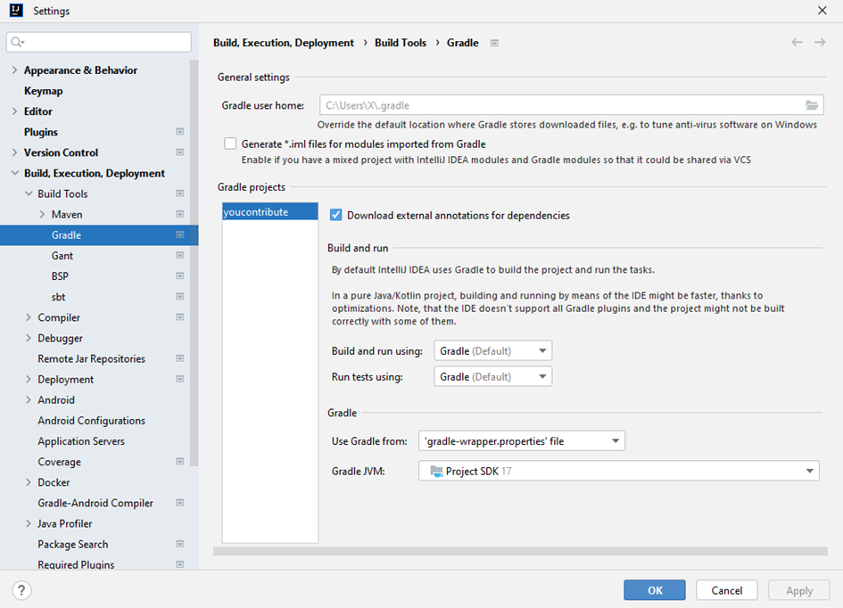
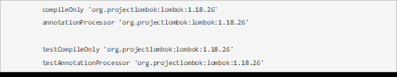
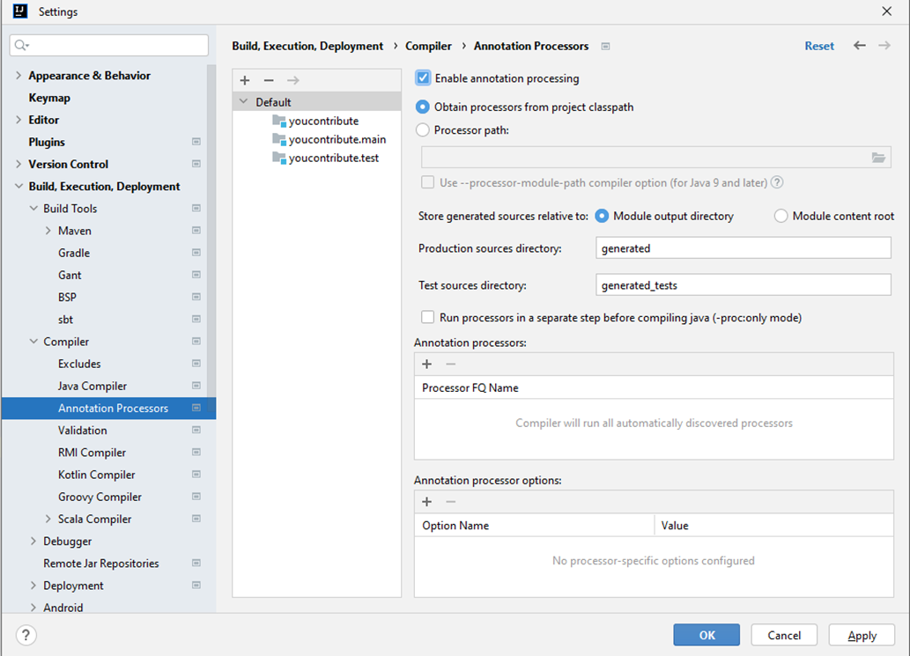
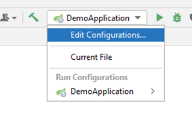
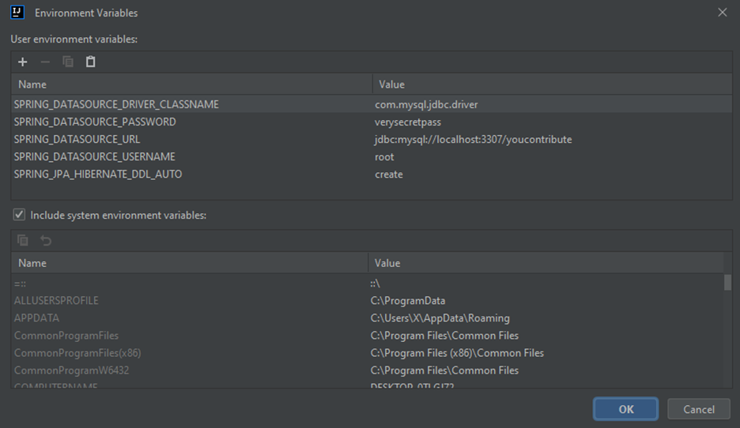

Spring CLI.zip download edilir

SpringCLI/bin klasöründe ki spring.bat çalıştırılır.

Fakat çalışması için Java17’ye ihtiyacı bulunmaktadır

spring init --type=gradle-project a--javaVersion=17 --dependencies=web,data-jpa,mysql youcontribute.zip komutu ile
spring boot projesi create edilmiş olur

Proje açıldıktan sonra; GradleJVM değiştirilmelidir.

build.gradle isimli dosya da sourceCompability kısmı java version’u kontrol edilmelidir

docker run -d -p 3307:3306 -v /d/docker-mysql:/var/lib/mysql -e MYSQL_ROOT_PASSWORD=verysecretpass -e
MYSQL_DATABASE=youcontribute mysql

docker komutu ile var/lib/mysql mysql docker image’inin default location’i olduğu için benim d diskimde ki docker-mysql
dizinine map ediyorum. Development için mysql container’i kullanmış oluyorum. Port 3307

Configuration içinde projeyi intellij ile açtıktan sonra resources klasörü altında otomatik olarak yaratılmış olan
application.properties isimli dosyası siliyorum yerine application.yml dosyasını ekliyorum.

build.gradle içerisine lombok dependency’lerini ekliyorum;

ekledikten sonra intellij içerisinde lombok’u kullanabilmek için aşağıda ki Enable annotation processing'i enabled hale
getiriyorum

Projenin otomatik tekrar başlatılması için spring-dev-tools’u projeye ekliyorum;

implementation group: 'org.springframework.boot', name: 'spring-boot-devtools', version: '3.0.4'

com.example.youcontribute altına yeni bir package olarak controllers isminde ki package’i onunda içerisine RepositoryController isimli class’ı create ediyorum. 

Controllers package’i altına request ve response’ları ayrı bir yerde tutmak için requests ve resources adlı package’ları create ediyorum.

Requests package’i altına RepositoryRequest, Resources package’i altına RepositoryResponse adlı class’ları ekliyorum.

com.example.youcontribute altına service adında yeni bir package create edip içerisine de RepositoryService isimli class’ı create ediyorum

com.example.youcontribute altına models isimli klasörü onunda içerisine RepositoryModel adlı model class’ımı create ediyorum

Docker MYSQL bağlantısı için intellij içerisinde enviroment variables’ları kullanarak database bağlantısını gerçekleştireceğim.

Dedikten sonra;

Modify options sekmesi altından Enviroment Variables’ları tıklıyorum;

Edit configuration altinda ki Enviroment Variables kismina GITHUB_API_TOKEN ekledim.

https://docs.github.com/en/authentication/keeping-your-account-and-data-secure/creating-a-personal-access-token

